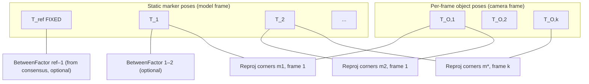

# Online vs offline optimization for multi-marker rigid-object layout calibration

Date: 2026-08-12

## Decision summary

**Offline batch bundle adjustment (BA) is not mathematically required** for marker layout calibration; it is the standard way to compute the **maximum a posteriori (MAP)** estimate of a nonlinear least-squares problem from all co-visible corner observations at once ([Dellaert and Kaess 2006](https://people.csail.mit.edu/kaess/pub/Dellaert06ijrr.pdf), [GTSAM factor-graph tutorial](https://gtsam.org/tutorials/intro.html)). The same MAP objective can, in principle, be maintained incrementally with iSAM/iSAM2, fixed-lag smoothing, or hybrid concurrent architectures ([Kaess et al. 2008](https://people.csail.mit.edu/kaess/pub/Kaess08tro.pdf), [Kaess et al. 2012](https://doi.org/10.1177/0278364911430419), [Dong-Si and Mourikis 2011](https://doi.org/10.1109/icra.2011.5980267), [Kaess et al. 2012 fusion](https://www.cs.cmu.edu/~kaess/pub/Kaess12fusion.pdf)).

For this repository's problem shape—**~20 static marker poses**, **independent per-frame object poses**, **no inter-frame motion model**, and **user-triggered final save with hard quality gates**—the current SciPy sparse corner BA remains the right **authoritative** backend. The practical bottleneck on 20-marker datasets is **discrete IPPE assignment filtering and pair-consensus support**, not batch solve time ([ADR 0002](../adr/0002-corner-bundle-adjustment-for-marker-calibration.md), [`marker_layout_calibration.py`](../../src/object_apriltag/marker_layout_calibration.py)).

**Build now:** incremental **diagnostics** (connectivity, pair support, assignment-rejection counts) plus **periodic warm-started SciPy preview solves** on a background snapshot during capture. **Keep** the existing batch pipeline and gates for `marker_model.json` writes.

**Do not build yet:** a GTSAM/iSAM2 production backend unless measured preview latency or dataset scale makes warm-started SciPy insufficient.

**Criteria to revisit a true incremental backend:** preview BA cannot keep pace with capture rate on target hardware; preview vs final-batch marker-footprint disagreement exceeds acceptance thresholds after diverse capture; or covariance/online factor removal becomes a product requirement.

## Scope and assumptions

This note concerns **Marker Model Calibration**: estimating rigid AprilTag sticker footprints on a known object from live **co-visibility observations** (≥2 expected markers visible per sample), producing `marker_model.json`. Terminology follows [`CONTEXT.md`](../../CONTEXT.md).

Assumptions aligned with the current implementation:

- The object is **rigid** during capture; marker stickers do not move relative to one another.
- **Camera intrinsics and distortion** are fixed and loaded from a prior calibration file; they are not jointly optimized during layout calibration ([`calibrate_marker_model.py`](../../src/object_apriltag/cli/calibrate_marker_model.py)).
- **Marker edge length** (`marker_size_m`) is known and uniform; it sets metric scale together with intrinsics.
- Each sample is an **independent object pose** relative to the camera (hand-held object). There is **no odometry factor** between consecutive frames.
- Per-marker pose hypotheses come from **planar IPPE** on four coplanar corners; OpenCV documents that IPPE requires coplanar points and that `solvePnPGeneric` exposes multiple IPPE solutions where applicable ([OpenCV solvePnP guide](https://docs.opencv.org/4.13.0/d5/d1f/calib3d_solvePnP.html)).
- A **reference marker** fixes gauge freedom (translation + rotation of the model frame), matching accepted ADR policy ([ADR 0002](../adr/0002-corner-bundle-adjustment-for-marker-calibration.md)).

Out of scope: online camera intrinsic calibration, deformable objects, dynamic time synchronization, and detection-pipeline changes.

## Current repository pipeline

Accepted architecture ([ADR 0002](../adr/0002-corner-bundle-adjustment-for-marker-calibration.md)):

1. **Accumulate** user-selected `FrameObservation` samples when **C** is pressed with ≥2 expected markers visible ([`calibrate_marker_model.py`](../../src/object_apriltag/cli/calibrate_marker_model.py)).
2. **Per frame:** `solvePnPGeneric(..., SOLVEPNP_IPPE)` yields up to two facing-camera candidates per marker ([`_ippe_candidates`](../../src/object_apriltag/marker_layout_calibration.py)).
3. **Pairwise consensus:** for each marker pair, seed-and-expand inlier sets over relative transforms; require `min_inliers_per_edge` frames and RMS gates ([`_estimate_pair_consensus`](../../src/object_apriltag/marker_layout_calibration.py)).
4. **Assignment filtering:** combinatorial search picks one IPPE candidate per marker per frame consistent with accepted pair edges; inconsistent frames are rejected ([`_assign_ippe_candidates`](../../src/object_apriltag/marker_layout_calibration.py)).
5. **Initialize** marker poses from the pose graph anchored at the reference marker; initialize per-frame poses from assigned candidates ([`_initialize_marker_poses`](../../src/object_apriltag/marker_layout_calibration.py), [`_initialize_frame_poses`](../../src/object_apriltag/marker_layout_calibration.py)).
6. **Sparse corner BA:** SciPy `least_squares` with analytic sparsity pattern, Huber loss, reference marker fixed ([`_run_bundle_adjustment`](../../src/object_apriltag/marker_layout_calibration.py)).
7. **Prune and refit:** drop outlier corners and frames without ≥2 complete markers; recheck pair support; rerun BA ([`_prune_and_refit`](../../src/object_apriltag/marker_layout_calibration.py)).
8. **Hard quality gates** before write: global/per-marker reprojection RMS, per-pair translation/rotation RMS, full connectivity ([`_check_quality_gates`](../../src/object_apriltag/marker_layout_calibration.py)).

Live capture currently solves **only on explicit `S` keypress**; the HUD shows coarse connectivity from raw pair counts, not the full assignment-filtered graph.

## Mathematical problem: batch MAP, not a different objective online

### Variables

Let marker \(m\) have pose \({}^{O}T_m = (R_m, t_m)\) in the **model frame** \(O\) (reference-marker-centered convention in code). Frame \(i\) has object/camera-relative pose \({}^{C}T_{O,i}\). Each observed corner \(j\) of marker \(m\) in frame \(i\) has image measurement \(u_{m,j,i}\).

Unknowns optimized in BA:

| Variable | Count (typical) | Role |
|----------|-----------------|------|
| Non-reference marker poses \({}^{O}T_m\) | \((M-1) \times 6\) | Static layout to estimate |
| Per-frame poses \({}^{C}T_{O,i}\) | \(N \times 6\) | Nuisance parameters for each sample |
| Reference marker pose | fixed | Gauge anchor |

Corner object points \(X_{m,j}\) in each marker frame are known from `marker_size_m` ([`marker_corner_object_points`](../../src/object_apriltag/pose.py)).

### Factors (residuals)

For each inlier corner observation:

\[
r_{m,j,i} = \pi\!\left({}^{C}T_{O,i}\,{}^{O}T_m\, X_{m,j};\, K, d\right) - u_{m,j,i}
\]

where \(\pi\) is OpenCV-style projection with intrinsics \(K\) and distortion \(d\) ([OpenCV calibration API](https://docs.opencv.org/4.9.0/d9/d0c/group__calib3d.html)).

The robustified objective matches SciPy's `least_squares` with `loss='huber'`:

\[
\min \sum_{m,j,i} \rho_\text{Huber}\!\left(\|r_{m,j,i}\|^2\right)
\]

with \(\rho\) defined in the official SciPy documentation ([SciPy `least_squares`](https://docs.scipy.org/doc/scipy/reference/generated/scipy.optimize.least_squares.html)).

Pair-consensus and assignment stages are **discrete front-end decisions** that select which corners and which IPPE branch enter the continuous optimization. They are not themselves part of the BA objective, but they determine the active factor set.

### Relation to SLAM / SfM literature

This is a **structure-from-motion / bundle adjustment** problem: static 3D structure (marker poses on the rigid object) plus moving camera/object poses, with reprojection factors ([Dellaert and Kaess 2006](https://people.csail.mit.edu/kaess/pub/Dellaert06ijrr.pdf), [Ceres bundle adjustment tutorial](http://ceres-solver.org/nnls_tutorial.html)). It is **not** a canonical SLAM trajectory problem: frames are **exchangeable** samples without Markov odometry edges. "Loop closure" here is simply **repeated co-observation of the same marker pairs** across frames—already handled by joint BA over all frames.

### Gauge freedom

Fixing the reference marker pose removes the \(SE(3)\) gauge of the rigid model frame. Without that fix, the entire marker cloud and all frame poses can undergo a common rigid transform without changing reprojection residuals—a standard BA gauge ambiguity ([Dellaert and Kaess 2006](https://people.csail.mit.edu/kaess/pub/Dellaert06ijrr.pdf)).

## Is offline batch optimization mathematically necessary?

**No.** Necessity would mean no online algorithm could recover the same estimand; that is false.

What batch BA provides:

- A direct solution of the **global nonlinear least-squares / MAP** problem using all selected factors at once ([Dellaert and Kaess 2006](https://people.csail.mit.edu/kaess/pub/Dellaert06ijrr.pdf)).
- Freedom to **revisit discrete decisions** (outlier pruning, frame rejection) before committing output—consistent with ADR quality gates ([ADR 0002](../adr/0002-corner-bundle-adjustment-for-marker-calibration.md)).

What incremental methods provide:

- **Computational** updates as new factors arrive, reusing factorization structure ([Kaess et al. 2008](https://people.csail.mit.edu/kaess/pub/Kaess08tro.pdf), [Kaess et al. 2012](https://doi.org/10.1177/0278364911430419)).
- **Low-latency estimates** during acquisition, at the cost of bookkeeping for relinearization, marginalization, or delayed corrections ([Kaess et al. 2012 fusion](https://www.cs.cmu.edu/~kaess/pub/Kaess12fusion.pdf), [Williams et al. 2014](https://dellaert.github.io/files/Williams14ijrr.pdf)).

For offline calibration with a human in the loop, **correctness is defined by the final gated batch solution**, not by whether every intermediate step was incremental. Incremental backends are justified when **latency, memory, or streaming scale** demand them—not because the estimand differs.

### Problem-size reality check for this repo

Order-of-magnitude for a 20-marker session:

- Frames \(N\): 200–2000 at 10 Hz over 20–200 s capture.
- Residuals: up to \(4 \times M \times N\) corner terms (often fewer after assignment rejection).
- Continuous unknowns: \(\approx 19 \times 6 + N \times 6\) (e.g. 114 + 1200 ≈ 1300 for 200 frames).

Ceres documents that **dense Schur** BA is appropriate up to "a hundred or so cameras" ([Ceres solving FAQ](http://ceres-solver.org/solving_faqs.html)); this problem is far smaller. The current SciPy implementation already exploits Jacobian sparsity via `jac_sparsity` ([`_build_jac_sparsity`](../../src/object_apriltag/marker_layout_calibration.py), [SciPy `least_squares`](https://docs.scipy.org/doc/scipy/reference/generated/scipy.optimize.least_squares.html)).

## Online formulations and fit to this calibration problem

### 1. Full incremental smoothing (iSAM / iSAM2)

**Mechanism:** Each new frame adds a pose variable and reprojection factors; iSAM updates a QR/information factorization incrementally ([Kaess et al. 2008](https://people.csail.mit.edu/kaess/pub/Kaess08tro.pdf)); iSAM2 maintains a Bayes tree with fluid relinearization and incremental variable reordering, avoiding periodic full batch steps ([Kaess et al. 2012](https://doi.org/10.1177/0278364911430419)). GTSAM's `ISAM2::update()` adds factors and relinearizes affected variables according to wildfire/relinearize thresholds ([GTSAM `ISAM2` API](https://gtsam.org/doxygen/a04947.html), [GTSAM ISAM2 docs](https://borglab.github.io/gtsam/isam2/)).

**Fit here:** Technically applicable—marker poses are static landmarks shared across frames, analogous to visual SLAM landmarks ([GTSAM intro §Visual SLAM](https://gtsam.org/tutorials/intro.html)). **Mismatch:** frames are not a temporal trajectory; iSAM's strength in **sequential ordering and loop closure** is underused. All frames could be added in arbitrary order with the same final MAP.

**Verdict:** Valid but **heavy** for preview; best reserved for very large \(N\) or if full posteriors are needed online.

### 2. Incremental bundle adjustment (ICE-BA, iLBA, etc.)

Specialized BA solvers exploit **incremental arrival** of measurements and Schur structure ([Liu et al. 2018](https://openaccess.thecvf.com/content_cvpr_2018/papers/Liu_ICE-BA_Incremental_Consistent_CVPR_2018_paper.pdf), [Indelman et al. 2015](https://indelman.github.io/ANPL-Website/Publications/Indelman15ras.pdf)). ICE-BA explicitly targets VI-SLAM with sliding-window and global BA in parallel ([Liu et al. 2018](https://openaccess.thecvf.com/content_cvpr_2018/papers/Liu_ICE-BA_Incremental_Consistent_CVPR_2018_paper.pdf)).

**Fit here:** Overkill unless preview latency on warm-started full BA fails acceptance tests. The marker-count / frame-count regime is tiny relative to ICE-BA's design center.

### 3. Fixed-lag / sliding-window smoothing

**Mechanism:** Maintain only the last \(L\) frames (or time window); marginalize older states into a prior on the remaining variables ([Dong-Si and Mourikis 2011](https://doi.org/10.1109/icra.2011.5980267), [Chiu et al. 2013](https://dellaert.github.io/files/Chiu13icra.pdf)). Bounds compute and memory; introduces **approximation** unless the final global solve recovers discarded information.

**Fit here:** Reasonable for **live preview** if memory is a concern, but **unsuitable as the sole save path** because marginalized early frames no longer participate equally in the global MAP. Hybrid: fixed-lag preview + batch finalization matches concurrent filtering/smoothing philosophy ([Kaess et al. 2012 fusion](https://www.cs.cmu.edu/~kaess/pub/Kaess12fusion.pdf), [Williams et al. 2014](https://dellaert.github.io/files/Williams14ijrr.pdf)).

### 4. Filtering / EKF

**Mechanism:** Recursively linearize; discard past state cross-correlations or approximate them. Square Root SAM argues smoothing stays sparse and avoids EKF inconsistency from irrevocable linearization choices ([Dellaert and Kaess 2006](https://people.csail.mit.edu/kaess/pub/Dellaert06ijrr.pdf)).

**Fit here:** **Poor match.** Marker layout needs global re-adjustment when new frames change which IPPE branches are viable; filtering fixes linearization history. Chiu et al. note filtering cannot update old linearization points when later measurements improve the solution ([Chiu et al. 2013](https://dellaert.github.io/files/Chiu13icra.pdf)).

### 5. Online pose-graph optimization only

**Mechanism:** Optimize relative pose edges without joint corner reprojection (pose-graph SLAM back-end).

**Fit here:** Already partially present as pair consensus + initialization. ADR rejected pose-graph-only output because errors compound and weak views are harder to reject consistently ([ADR 0002](../adr/0002-corner-bundle-adjustment-for-marker-calibration.md)). Pose-graph online updates could preview **topology**, not final layout quality.

### 6. Hybrid: online factor insertion + final batch refinement

**Mechanism:** Insert factors as observations arrive (incremental or periodic batch), use online diagnostics for capture guidance; **authoritative** model from full batch BA + gates at save.

**Fit here:** **Best practical architecture** for this repo. Matches how capture already works (accumulate, solve on `S`) while addressing the user's need for live feedback. Concurrent filtering/smoothing shows filter and smoother can be views on one factor graph, recovering batch solution asymptotically ([Williams et al. 2014](https://dellaert.github.io/files/Williams14ijrr.pdf)).

## Factor-graph representation of this exact problem

Using the factor-graph definition \(f(\Theta) = \prod_i f_i(\Theta_i)\) ([Kschischang et al. 2001](https://ieeexplore.ieee.org/document/910572) via [GTSAM intro](https://gtsam.org/tutorials/intro.html)):



**Variables**

| Symbol | GTSAM-style type | In current code |
|--------|------------------|-----------------|
| \({}^{O}T_\text{ref}\) | `Pose3` prior (fixed) | `_reference_gauge_pose` + fixed in `_pack_parameters` |
| \({}^{O}T_m,\, m \neq \text{ref}\) | `Pose3` | `marker_poses` |
| \({}^{C}T_{O,i}\) | `Pose3` | `frame_poses[i]` |
| IPPE branch per \((i,m)\) | discrete | `_MarkerCandidate` choice in `assigned_candidates` |

**Factors**

| Factor | Purpose | Current stage |
|--------|---------|---------------|
| `PriorFactor` on reference | Gauge fix | hard-coded reference pose |
| `BetweenFactor` on marker pairs | Optional soft/extra constraints from consensus | used in assignment scoring, not as continuous factors in BA |
| `GenericProjectionFactor` / custom reprojection | Corner observations | `_corner_errors` / `_run_bundle_adjustment` |
| Robust noise (Huber) | Outlier down-weight | SciPy `loss='huber'` |
| Switchable / max-mixture | Robustify wrong data association | **not implemented**; discrete rejection instead ([Sünderhauf and Protzel 2012](https://doi.org/10.1109/iros.2012.6385590)) |

**Gauge:** reference marker pose fixed—equivalent to a strong prior on \({}^{O}T_\text{ref}\) ([ADR 0002](../adr/0002-corner-bundle-adjustment-for-marker-calibration.md)).

**Planar ambiguity / data association:** IPPE can return multiple poses for coplanar points ([OpenCV solvePnP guide](https://docs.opencv.org/4.13.0/d5/d1f/calib3d_solvePnP.html)); the IPPE authors' implementation notes the two-solution behavior for planar targets ([Collins IPPE repository](https://github.com/tobycollins/IPPE)). The codebase handles this **outside** the factor graph via pair consensus and combinatorial assignment—not via switchable constraints ([Sünderhauf and Protzel 2012](https://doi.org/10.1109/iros.2012.6385590)).

## Incremental machinery: relinearization, loop closure, delays, memory

| Concern | Batch SciPy BA (current) | iSAM2 / GTSAM | Fixed-lag | Filtering |
|---------|--------------------------|---------------|-----------|-----------|
| **Relinearization** | Every solve from current iterate | Fluid, per-variable thresholds ([Kaess et al. 2012](https://doi.org/10.1177/0278364911430419), [GTSAM `ISAM2`](https://gtsam.org/doxygen/a04947.html)) | Periodic within window | Single linearization per step ([Dellaert and Kaess 2006](https://people.csail.mit.edu/kaess/pub/Dellaert06ijrr.pdf)) |
| **Loop closure** | N/A (all frames jointly) | Edits Bayes tree when new factors link old variables ([Kaess et al. 2012](https://doi.org/10.1177/0278364911430419)) | Closures outside window need marginal prior | Cannot fully reconcile distant closures |
| **Delayed corrections** | None (global each solve) | Older states update when relinearized | Delayed until batch final or window overlap | Past states never fully corrected |
| **Marginalization** | Implicit (Schur on frames in Ceres sense) | Supported via `marginalFactors` in GTSAM ([GTSAM ISAM2 docs](https://borglab.github.io/gtsam/isam2/)) | Required; introduces consistency pitfalls if mishandled ([Liu et al. 2018](https://openaccess.thecvf.com/content_cvpr_2018/papers/Liu_ICE-BA_Incremental_Consistent_CVPR_2018_paper.pdf)) | Built-in |
| **Memory growth** | \(O(N + M)\) per solve input | Grows with full history unless pruned | Bounded by lag \(L\) | Bounded |
| **Implementation burden** | Low (already shipped) | High (C++ dep, manifolds, noise models) | Medium–high | Medium, poor accuracy trade |

For calibration, **"loop closure"** is observing the same marker pair from a new viewpoint. Batch BA propagates that immediately to all markers connected in the co-visibility graph. Incremental methods defer full coupling until relinearization reaches affected cliques ([Kaess et al. 2012](https://doi.org/10.1177/0278364911430419)).

## Method comparison for this codebase

| Criterion | Batch BA (SciPy) | Full iSAM2 | Fixed-lag smoother | EKF / filtering | Pose-graph only |
|-----------|------------------|------------|--------------------|-----------------|-----------------|
| **Accuracy vs global MAP** | Reference | Exact incremental MAP if all factors kept ([Kaess et al. 2012](https://doi.org/10.1177/0278364911430419)) | Approximate until final batch | Biased under nonlinearity ([Dellaert and Kaess 2006](https://people.csail.mit.edu/kaess/pub/Dellaert06ijrr.pdf)) | No corner joint refinement ([ADR 0002](../adr/0002-corner-bundle-adjustment-for-marker-calibration.md)) |
| **Robustness to IPPE outliers** | Huber + prune + discrete gates | Needs robust kernels / switchable factors ([Sünderhauf and Protzel 2012](https://doi.org/10.1109/iros.2012.6385590)) | Same | Poor | Pair gates only |
| **Complexity @ 20 markers, ~500 frames** | Low–moderate single solve | Setup >> solve | Moderate window ops | Low per step | Low |
| **Dependencies** | SciPy (already core) | GTSAM (+ build) | GTSAM or custom marginalization | scipy/numpy | numpy |
| **Preview during capture** | Periodic warm-started OK | Natural | Natural | Fast but misleading | Topology only |
| **Matches ADR save gates** | Yes | Possible with full graph at end | Only via final batch | No | Insufficient |

## Can pair-consensus / IPPE assignment be updated online?

**Yes, partially.** The stages are inherently **streaming-friendly**; the hard part is **consistency when discrete choices change**.

### Pair consensus — viable online sufficient statistics

For each unordered pair \((a,b)\), maintain:

- multiset of **candidate relative transforms** per frame (from IPPE cross-products), as now in `_collect_pair_hypotheses`;
- running **best seed** and inlier frame set per pair (`_inlier_frames_for_seed` logic);
- **diagnostics**: inlier count, translation/rotation RMS ([`_edge_diagnostics`](../../src/object_apriltag/marker_layout_calibration.py)).

Incremental update per new frame:

1. Generate pair hypotheses for co-visible markers in that frame only.
2. For each pair, either attach to current seed inlier set or, if incompatible, store as alternate hypothesis (track second-best seed).
3. Recompute connectivity (`_connected_marker_ids`) for HUD.

**Limitations:** Changing the winning seed after more data can **flip** relative transforms discontinuously; downstream assignments must be recomputed. This is standard data-association delay, not unique to this repo ([Kaess et al. 2008](https://people.csail.mit.edu/kaess/pub/Kaess08tro.pdf) on uncertainty for association).

### Assignment filtering — online strategies

Current: full backtracking per frame against static `pair_consensus` ([`_search_assignments`](../../src/object_apriltag/marker_layout_calibration.py)).

Online options:

| Strategy | Description | Limitation |
|----------|-------------|------------|
| **Per-frame greedy + lazy revalidate** | Accept frame if best assignment exists; on consensus change, mark past frames `stale` and re-run assignment pass | Rejection counts can jump retroactively—user confusion |
| **Sliding validity window** | Only re-validate last \(W\) frames online; full pass at save | Early bad frames may survive until batch |
| **Sufficient statistic: per-frame best score + margin** | Track assignment cost; re-solve when pair edge moves > gate | Does not guarantee global assignment consistency |
| **Deferred hard rejection** | Preview uses soft weights; hard rejection only at batch save | Preview optimism bias |

**Why many frames/edges reject today:** assignment requires **every constrained pair** in a frame to agree with consensus within gates ([`_score_assignment`](../../src/object_apriltag/marker_layout_calibration.py)). With 20 markers, a frame can contain many pairs; one wrong IPPE branch fails the whole frame. Near-planar viewing increases ambiguous IPPE branches ([OpenCV solvePnP guide](https://docs.opencv.org/4.13.0/d5/d1f/calib3d_solvePnP.html)). Online incremental consensus does not remove this—it may surface it earlier.

**Factor insertion/removal:** If using a factor graph backend, each accepted frame adds one pose variable and up to \(4M\) reprojection factors; removing a frame means deleting those factors and the pose ([GTSAM `ISAM2::update` with `removeFactorIndices`](https://gtsam.org/doxygen/a04947.html)). SciPy path: rebuild active `inlier_mask` and warm-start from previous solution.

## Recommended architecture for this repository

### Phase A — Now (low dependency)

```
Capture loop
  ├─ append FrameObservation (existing)
  ├─ incremental pair-consensus + connectivity HUD (extend CLI diagnostics)
  ├─ background thread: snapshot observations → warm-start calibrate_marker_layout (preview only)
  └─ on 'S': synchronous full calibrate_marker_layout → gates → save (unchanged authority)
```

**Do not replace SciPy** for final save. SciPy `least_squares` with `jac_sparsity` and Huber is appropriate for this problem size ([SciPy `least_squares`](https://docs.scipy.org/doc/scipy/reference/generated/scipy.optimize.least_squares.html)); Ceres/GTSAM Schur solvers target much larger camera counts ([Ceres solving FAQ](http://ceres-solver.org/solving_faqs.html)).

**Warm-started periodic SciPy** (lower-dependency alternative to GTSAM):

- Copy `observations` under a lock (immutable snapshot).
- Run `calibrate_marker_layout` on snapshot with `max_ba_iterations` capped for preview.
- Seed `x0` from previous preview marker/frame poses when frame indices align.
- Display preview footprints, reprojection RMS, rejected-frame fraction—**never write** `marker_model.json` from preview.

### Phase B — Not yet

- GTSAM `ISAM2` backend shared with preview and batch.
- Switchable constraints for wrong IPPE associations ([Sünderhauf and Protzel 2012](https://doi.org/10.1109/iros.2012.6385590)).
- Ceres migration (only if analytic Jacobians / Schur structure needed for speed at larger scale).

**GTSAM justified when:** preview period < capture interval on target hardware **and** warm-started SciPy fails measurable acceptance; or joint covariance of marker poses is required for downstream uncertainty ([Kaess et al. 2008](https://people.csail.mit.edu/kaess/pub/Kaess08tro.pdf)).

### Assignment / consensus improvements (orthogonal to backend)

These reduce rejections without incremental optimization:

- Soften per-frame rejection: allow partial-marker frames into BA with robust loss (trade-off: weaker per-frame coherence).
- Loosen assignment to **soft** pair penalties inside BA instead of hard pre-BA rejection (requires careful tuning; related to switchable constraints literature).
- Require stronger viewing diversity before declaring an edge "stable" in HUD (operational guidance).

## Trigger policies for preview solves

| Trigger | Use | Notes |
|---------|-----|-------|
| Every \(N\) frames (e.g. 20–50) | Default steady preview | Amortize solve cost; \(N\) ≈ `min_inliers_per_edge` is sensible |
| Every \(T\) seconds (e.g. 2–5 s) | Rate-limited on fast motion | Prevents backlog when \(N\) small |
| Graph connectivity change | New marker ID or edge crosses `min_inliers_per_edge` | High-value user feedback |
| New marker/edge in consensus | Pair seed promotion | May invalidate prior assignments—flag "stale preview" |
| User request (`P` key) | On-demand | Same snapshot discipline |
| Before save (`S`) | Mandatory full batch | Already required; preview must not shortcut gates |

**Background thread / consistency**

- Main thread appends observations; preview thread reads **`tuple(observations)` snapshot** (copy corners).
- Preview results tagged with `snapshot_id` / frame count; HUD shows "preview @ N frames" to avoid mixing stale graphics.
- Final `S` solve runs on main thread with latest data; no concurrent mutation during solve.
- If preview in flight when `S` pressed, cancel preview or wait—never partial-merge preview into final.

## Observability and failure conditions

| Condition | Symptom in current pipeline | Mechanism |
|-----------|----------------------------|-----------|
| **Disconnected graph** | `missing` marker IDs; refusal | No chain of pair edges with enough inliers to reference ([`_estimate_pair_consensus`](../../src/object_apriltag/marker_layout_calibration.py)) |
| **Weak viewing geometry** | High assignment rejection; high BA RMS | Planar IPPE ambiguity, ill-conditioned triangulation ([OpenCV solvePnP guide](https://docs.opencv.org/4.13.0/d5/d1f/calib3d_solvePnP.html)) |
| **Single-marker views** | Samples ignored (need ≥2 markers) | No relative constraint ([`calibrate_marker_model.py`](../../src/object_apriltag/cli/calibrate_marker_model.py)) |
| **Insufficient co-visibility per edge** | Edge dropped; connectivity break | `min_inliers_per_edge` ([`CalibrationSettings`](../../src/object_apriltag/marker_layout_calibration.py)) |
| **Intrinsics error** | Systematic reprojection bias; scale wrong | Corners explained by wrong \(K,d\) ([OpenCV calibration model](https://docs.opencv.org/4.9.0/d9/d0c/group__calib3d.html)); see [2026-08-11 research note](./2026-08-11-object-landmark-error-measurement.md) |
| **Wrong `marker_size_m`** | Metric layout scaled wrong | Scale couples with translation; gates may still pass locally |
| **Object motion during sample** | Inflated pair RMS; prune drops frames | Violates rigid assumption |
| **All markers coplanar on object** | Degenerate layout in \(Z\) relative to reference frame | Rank-deficient structure without out-of-plane parallax (SfM degeneracy; cf. [Dellaert and Kaess 2006](https://people.csail.mit.edu/kaess/pub/Dellaert06ijrr.pdf)) |

**Observability summary:** marker layout is observable up to fixed gauge when the co-visibility graph is connected **and** diverse viewpoints provide parallax on each marker's position/orientation. Batch BA over many frames is the standard way to combine such weak individual views ([Dellaert and Kaess 2006](https://people.csail.mit.edu/kaess/pub/Dellaert06ijrr.pdf)).

## Implementation sketch (no production code)

### New / extended modules

| Component | Maps from | Responsibility |
|-----------|-----------|----------------|
| `CalibrationSession` | `list[FrameObservation]` + monotonic `snapshot_id` | Thread-safe append; `snapshot()` → immutable copy |
| `IncrementalPairTracker` | `_collect_pair_hypotheses`, `_estimate_pair_consensus` | Incremental edge stats; `connectivity(expected_ids)` |
| `AssignmentIndex` | `_assign_ippe_candidates` | Optional: store per-frame assignment + stale flag |
| `PreviewSolver` | `calibrate_marker_layout` | Subsample or cap iterations; warm-start poses dict |
| `CalibrationDiagnostics` | `CalibrationQualityReport` + tracker | HUD: rejected frames, stale preview, edge RMS |

### Function-level mapping

| Current function | Online role | Final batch role |
|------------------|-------------|------------------|
| `_estimate_frame_candidates` | Per new frame | Full recompute OK |
| `_estimate_pair_consensus` | `IncrementalPairTracker.update(frame)` | Full recompute at save |
| `_assign_ippe_candidates` | Preview: last \(W\) frames or all | Full at save |
| `_initialize_marker_poses` | Warm-start marker poses | Same |
| `_initialize_frame_poses` | Warm-start new frame only | Full |
| `_run_bundle_adjustment` | Preview with fewer `max_ba_iterations` | Full iterations + gates |
| `_prune_and_refit` | Optional lighter preview | Full at save |
| `_check_quality_gates` | Display only | **Enforce before write** |

### CLI integration ([`calibrate_marker_model.py`](../../src/object_apriltag/cli/calibrate_marker_model.py))

- Extend HUD `pair_counts` / `connected_ids` to use `IncrementalPairTracker` (assignment-aware optional).
- Add preview worker triggered every \(N\) frames; store `last_preview_quality`.
- Keep `S` → synchronous `calibrate_marker_layout` → `save_marker_model` unchanged.

### Data structures

Reuse existing dataclasses (`FrameObservation`, `CalibrationSettings`, `CalibrationQualityReport`). Add lightweight:

- `PairEdgeState`: `marker_a`, `marker_b`, `inlier_frames: frozenset[int]`, `rotation_ba`, `translation_ba`, `diagnostics`
- `PreviewState`: `snapshot_id`, `frame_count`, `result: CalibrationResult | None`, `in_progress: bool`

## Decision-oriented recommendation

### Build now

1. **Incremental pair-consensus tracker** for live connectivity and edge RMS in the HUD (addresses observed pain on 20-marker datasets without changing save logic).
2. **Periodic warm-started SciPy preview** (background snapshot) showing footprints and `CalibrationQualityReport` fields.
3. **Explicit reporting** of assignment-rejected frame fraction and which marker pairs lack inliers—actionable capture guidance.
4. **Keep authoritative batch solve + ADR gates** on `S`.

### Do not build yet

1. GTSAM/Ceres production backend replacement.
2. Full iSAM2 maintaining full frame history for save.
3. EKF-style online layout filter.
4. Switchable-constraint joint optimization of discrete IPPE branches (research-grade complexity).

### Measurable criteria to justify true incremental backend later

| Metric | Threshold (example) | Implication |
|--------|---------------------|-------------|
| Preview latency p95 | > 2× capture interval on target laptop | Need incremental factorization |
| Warm-started SciPy vs cold batch footprint error | Max corner displacement > 0.5 mm @ marker scale | Need better online convergence |
| Session size | \(N > 5000\) frames routinely | Memory/time for batch snapshot |
| Preview vs final batch disagreement | Per-marker footprint > gate after diverse capture | Incremental approximation insufficient |
| Product need | Marker layout covariance for tolerance analysis | GTSAM `marginalCovariance` path ([GTSAM ISAM2 docs](https://borglab.github.io/gtsam/isam2/)) |

Until those triggers fire, **incremental optimization is an implementation strategy for preview latency**, not a prerequisite for correct marker layout calibration.

## Source register: strength and limitations

**Strength A — normative / official implementation evidence**

- [OpenCV solvePnP guide](https://docs.opencv.org/4.13.0/d5/d1f/calib3d_solvePnP.html): IPPE coplanarity, multi-solution via `solvePnPGeneric`. **Limitation:** does not prescribe multi-marker fusion or assignment policy.
- [OpenCV calibration API](https://docs.opencv.org/4.9.0/d9/d0c/group__calib3d.html): projection and distortion model used in residuals. **Limitation:** no camera-specific accuracy certificate.
- [SciPy `least_squares`](https://docs.scipy.org/doc/scipy/reference/generated/scipy.optimize.least_squares.html): Huber loss, sparse Jacobian support, trust-region solvers. **Limitation:** not a factor-graph library; no native incremental API.
- [Ceres Solver documentation](http://ceres-solver.org/nnls_tutorial.html), [solving FAQ](http://ceres-solver.org/solving_faqs.html): BA formulation, Schur solver sizing guidance. **Limitation:** C++ dependency; not integrated in this repo.
- [GTSAM tutorials and `ISAM2` API](https://gtsam.org/tutorials/intro.html), [ISAM2 docs](https://borglab.github.io/gtsam/isam2/), [`ISAM2` Doxygen](https://gtsam.org/doxygen/a04947.html): factor graphs, incremental updates, marginal queries. **Limitation:** integration and build cost for this Python-centric project.
- [Collins IPPE repository](https://github.com/tobycollins/IPPE): author implementation context for planar two-solution behavior. **Limitation:** this repo uses OpenCV's IPPE, not this library directly.

**Strength B — peer-reviewed / foundational primary research**

- [Dellaert and Kaess 2006](https://people.csail.mit.edu/kaess/pub/Dellaert06ijrr.pdf) (Square Root SAM): smoothing vs filtering; BA/SfM equivalence; sparsity. **Limitation:** SLAM-centric examples; manual object motion maps to "camera" side.
- [Kaess et al. 2008](https://people.csail.mit.edu/kaess/pub/Kaess08tro.pdf) (iSAM): incremental QR on information matrix; association uncertainty access. **Limitation:** sequential ordering assumptions weaker here.
- [Kaess et al. 2012](https://doi.org/10.1177/0278364911430419) (iSAM2): Bayes tree, fluid relinearization, no periodic batch. **Limitation:** designed for long robot trajectories.
- [Kschischang et al. 2001](https://ieeexplore.ieee.org/document/910572) (factor graphs): formal definition used in GTSAM expositions. **Limitation:** general theory, not calibration-specific.
- [Dong-Si and Mourikis 2011](https://doi.org/10.1109/icra.2011.5980267) (fixed-lag smoothing): sliding-window estimation. **Limitation:** consistency analysis under different motion models.
- [Kaess et al. 2012 fusion](https://www.cs.cmu.edu/~kaess/pub/Kaess12fusion.pdf), [Williams et al. 2014](https://dellaert.github.io/files/Williams14ijrr.pdf) (concurrent filtering and smoothing): hybrid real-time + batch optimality. **Limitation:** navigation-focused; adaptation required for static layout.
- [Sünderhauf and Protzel 2012](https://doi.org/10.1109/iros.2012.6385590) (switchable constraints): robust pose-graph with wrong loop closures. **Limitation:** pose-graph edges, not corner reprojection factors.
- [Liu et al. 2018](https://openaccess.thecvf.com/content_cvpr_2018/papers/Liu_ICE-BA_Incremental_Consistent_CVPR_2018_paper.pdf) (ICE-BA): incremental consistent BA for VI-SLAM. **Limitation:** IMU coupling; scale beyond repo needs.
- [Indelman et al. 2015](https://indelman.github.io/ANPL-Website/Publications/Indelman15ras.pdf) (iLBA): incremental structureless BA. **Limitation:** different parameterization than fixed marker corners.
- [Chiu et al. 2013](https://dellaert.github.io/files/Chiu13icra.pdf) (sliding-window factor graphs): filtering vs smoothing trade-offs. **Limitation:** VI navigation context.

**Repository primary sources**

- [ADR 0002](../adr/0002-corner-bundle-adjustment-for-marker-calibration.md): accepted corner BA + gates.
- [`marker_layout_calibration.py`](../../src/object_apriltag/marker_layout_calibration.py): implemented discrete + continuous pipeline.
- [2026-08-11 object landmark error research](./2026-08-11-object-landmark-error-measurement.md): intrinsics/ambiguity context for capture quality.
